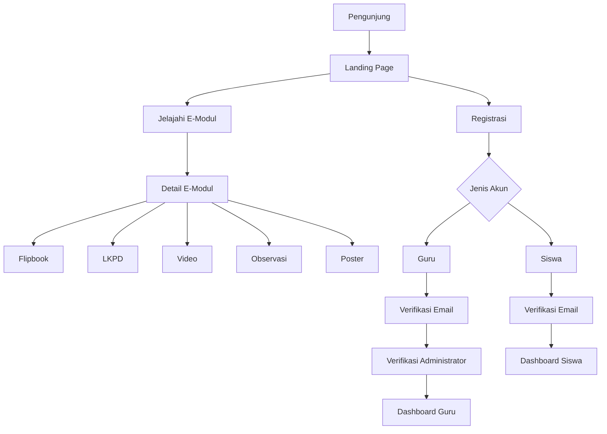
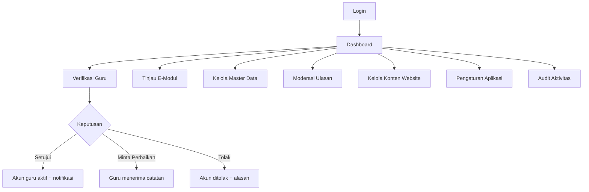
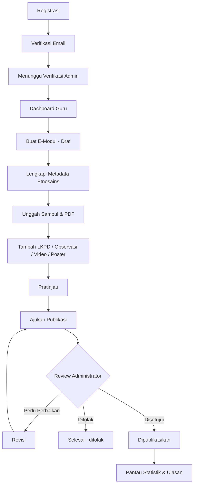
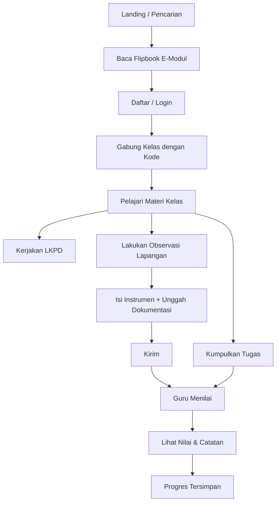
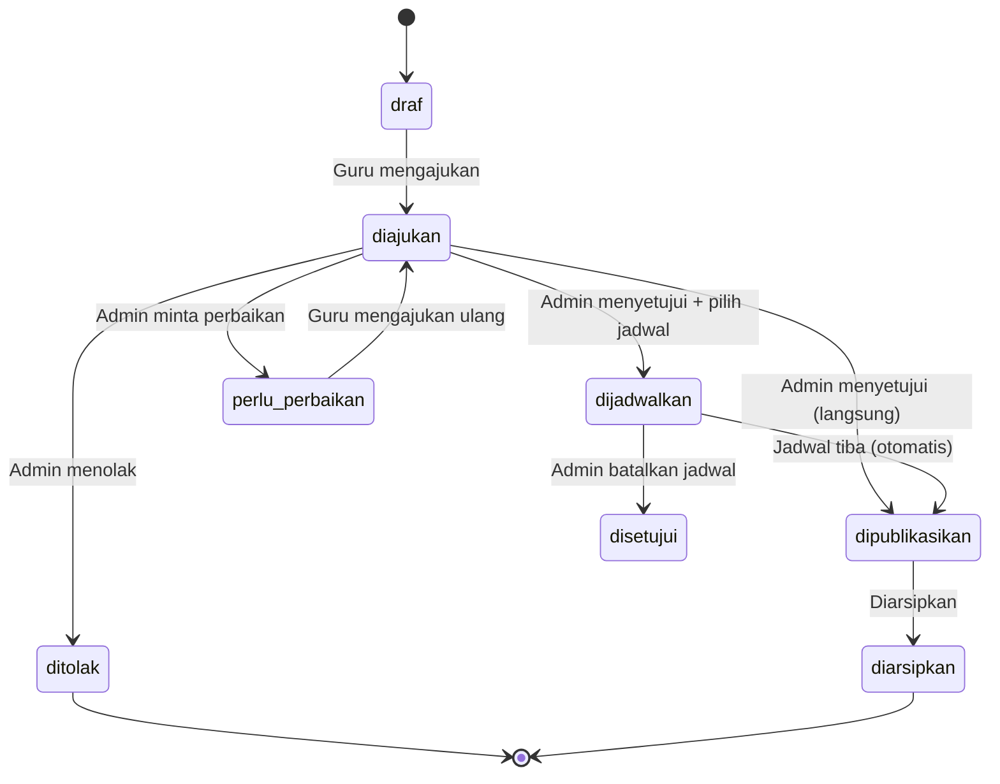
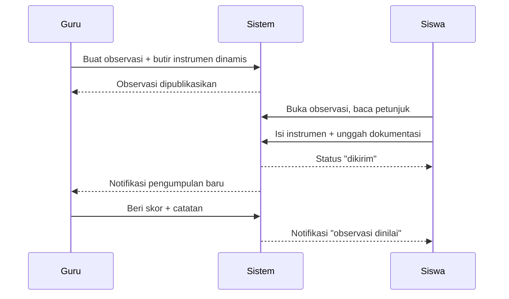
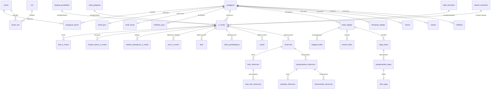

# E-ETNOSAINS

**Platform E-Modul Pembelajaran Berbasis Etnosains dan Kearifan Lokal**

Portal pembelajaran digital yang menghubungkan konsep sains dengan kearifan lokal
Indonesia. Guru menyusun dan mempublikasikan e-modul, LKPD, bahan ajar, video, poster,
serta aktivitas observasi; siswa mempelajarinya, bergabung ke kelas belajar, mengerjakan
observasi lapangan, dan mengumpulkan tugas; Administrator memverifikasi guru, meninjau
konten, dan mengelola seluruh identitas serta konfigurasi aplikasi.

---

## Daftar Isi

- [Tentang Aplikasi](#tentang-aplikasi)
- [Latar Belakang](#latar-belakang)
- [Tujuan](#tujuan)
- [Fitur Utama](#fitur-utama)
- [Teknologi](#teknologi)
- [Persyaratan Sistem](#persyaratan-sistem)
- [Arsitektur](#arsitektur)
- [Level Pengguna](#level-pengguna)
- [Hak Akses](#hak-akses)
- [Modul Utama](#modul-utama)
- [Peta URL dan SEO](#peta-url-dan-seo)
- [Alur Sistem](#alur-sistem)
- [Workflow Administrator](#workflow-administrator)
- [Workflow Guru](#workflow-guru)
- [Workflow Siswa](#workflow-siswa)
- [Workflow Publikasi E-Modul](#workflow-publikasi-e-modul)
- [Workflow Observasi](#workflow-observasi)
- [Struktur Database](#struktur-database)
- [Struktur Direktori](#struktur-direktori)
- [Instalasi](#instalasi)
- [Konfigurasi Environment](#konfigurasi-environment)
- [Database](#database)
- [Seeder](#seeder)
- [Akun Demo](#akun-demo)
- [Storage](#storage)
- [Menjalankan Development](#menjalankan-development)
- [Build Production](#build-production)
- [Testing](#testing)
- [Worktrough Aplikasi](#worktrough-aplikasi)
- [Queue dan Scheduler](#queue-dan-scheduler)
- [Deployment Shared Hosting](#deployment-shared-hosting)
- [Deployment VPS](#deployment-vps)
- [Deployment Nginx](#deployment-nginx)
- [Deployment Apache](#deployment-apache)
- [SSL](#ssl)
- [Cron](#cron)
- [Backup](#backup)
- [Keamanan](#keamanan)
- [Troubleshooting](#troubleshooting)
- [Maintenance](#maintenance)
- [Update Aplikasi](#update-aplikasi)
- [Checklist Production](#checklist-production)
- [Catatan Production](#catatan-production)
- [Lisensi](#lisensi)

---

## Tentang Aplikasi

E-ETNOSAINS bukan sekadar repositori PDF. Setiap E-Modul membawa metadata etnosains
terstruktur yang secara eksplisit menghubungkan empat hal:

```
Pengetahuan Lokal  +  Fenomena Budaya  +  Konsep Sains  +  Pembelajaran
```

Metadata tersebut tersimpan sebagai kolom tersendiri pada tabel `e_modul`
(`pengetahuan_lokal`, `konsep_sains`, `konteks_wilayah`, `aktivitas_saintifik`,
`nilai_karakter`) dan ditampilkan sebagai panel **Eksplorasi Etnosains** pada halaman
detail publik — inilah pembeda utama aplikasi ini dari repositori e-modul biasa.

**Nama aplikasi bersifat dinamis.** Tidak ada string "E-ETNOSAINS" yang di-*hard-code*
pada tampilan. Seluruh identitas dibaca melalui helper `pengaturan('nama_aplikasi')` yang
bersumber dari tabel `pengaturan_aplikasi` dan dapat diubah Administrator melalui menu
**Pengaturan Aplikasi** tanpa menyentuh kode.

## Latar Belakang

Pembelajaran sains di Indonesia sering terasa terlepas dari konteks keseharian siswa,
padahal praktik kearifan lokal — pengolahan gula aren, racikan jamu, sistem irigasi Subak,
pengawetan rendang — sarat konsep sains yang dapat dipelajari secara langsung. E-ETNOSAINS
menyediakan wadah agar guru dapat mendokumentasikan hubungan tersebut secara terstruktur
dan membagikannya sebagai sumber belajar yang dapat diakses publik.

## Tujuan

1. Menyediakan portal publikasi e-modul berbasis etnosains yang dapat diakses tanpa login.
2. Memberi guru alur kerja lengkap dari penyusunan draf hingga publikasi terverifikasi.
3. Menghubungkan satu judul E-Modul dengan seluruh konten pendukungnya (LKPD, observasi,
   video, poster) dalam satu halaman.
4. Memfasilitasi pembelajaran aktif melalui kelas belajar, instrumen observasi lapangan
   yang dapat dirancang guru, serta penilaian tugas.
5. Menjaga mutu konten melalui verifikasi guru dan peninjauan E-Modul oleh Administrator.

## Fitur Utama

### Tampilan dan Antarmuka

- **Mode gelap dan terang** dengan tiga pilihan: Terang, Gelap, dan Ikuti Sistem.
  Preferensi disimpan di `localStorage` dan diterapkan lewat skrip kecil di `<head>`
  sebelum halaman dirender, sehingga tidak ada kedipan putih saat memuat halaman dalam
  mode gelap. Tombol tema tersedia di navbar publik, halaman autentikasi, dan topbar
  seluruh dashboard.
- Navigasi publik bertingkat: menu tingkat atas dijaga ringkas dan katalog konten
  dikelompokkan ke dalam submenu **Jelajahi**, memakai kolom `induk_id` pada tabel
  `menu_navigasi` sehingga strukturnya tetap dapat diubah Administrator.
- Komponen Blade seragam dengan status fokus yang terlihat, atribut ARIA, dan transisi
  yang menghormati `prefers-reduced-motion`.

### Portal Publik (tanpa login)

- Landing page dinamis: banner, statistik riil dari database, E-Modul pilihan dan terbaru,
  topik etnosains populer, LKPD, observasi, testimoni, dan FAQ — semuanya dari database.
- Katalog E-Modul, LKPD, Bahan Ajar, Video, Poster, Observasi, Evaluasi, dan Topik
  Etnosains.
- **Flipbook PDF** dengan efek balik halaman (PDF.js + page-flip), navigasi halaman,
  zoom, layar penuh, dukungan keyboard, dan mode pembaca vertikal otomatis di perangkat
  mobile.
- Halaman detail E-Modul yang menampilkan panel Eksplorasi Etnosains, seluruh konten
  pendukung, ulasan, tombol bagikan, dan **QR Code** untuk media cetak.
- Pencarian global dengan filter jenjang, mata pelajaran, topik, dan pengurutan.
- Profil publik guru, halaman statis yang dapat diedit Administrator, `sitemap.xml`
  dinamis, dan `robots.txt` dinamis.

### Administrator

- Dashboard statistik dan antrean pekerjaan (guru menunggu verifikasi, E-Modul menunggu
  review).
- Verifikasi guru: setujui, tolak, atau minta perbaikan data disertai catatan.
- Peninjauan E-Modul: setujui & publikasikan, minta perbaikan, atau tolak — dengan riwayat
  status yang tidak pernah ditimpa.
- **Jadwal publikasi**: saat menyetujui, Administrator dapat memilih tanggal & jam terbit
  di masa depan alih-alih menerbitkan langsung. Perintah terjadwal
  `e-modul:terbitkan-terjadwal` (berjalan tiap menit lewat scheduler) yang menerbitkannya
  begitu jadwal tiba, sehingga tidak perlu online saat itu. Penjadwalan dapat dibatalkan
  selama belum terbit.
- **Riwayat versi E-Modul**: setiap kali E-Modul terbit (langsung maupun via jadwal),
  seluruh isinya dibekukan sebagai satu baris baru di tabel `versi_e_modul` — abadi, tidak
  pernah ditimpa maupun dihapus — sehingga versi lama tetap bisa ditelusuri dan dibuka
  kembali.
- **Ekspor laporan** (XLSX/CSV): daftar pengguna dan daftar E-Modul dapat diunduh sebagai
  spreadsheet lewat `App\Services\EksporService` (memakai PhpSpreadsheet), mengikuti
  filter yang sedang aktif di halaman.
- Master data: jenjang pendidikan, mata pelajaran, topik etnosains, daerah etnosains,
  instansi pendidikan, dan tag.
- Konten website: banner, testimoni, FAQ, halaman statis, pengumuman.
- **Manajemen pengguna penuh**: edit profil (nama, email, nomor telepon), atur ulang kata
  sandi langsung dari admin, blokir/aktifkan akun, dan hapus (soft delete) — dengan
  penjagaan agar admin tidak dapat memblokir atau menghapus akunnya sendiri.
- Moderasi ulasan, pengaturan aplikasi, dan audit aktivitas.
- Setiap halaman tabel admin memiliki pencarian dan filter sendiri (nama/email, peran,
  status, tanggal, dsb.), dengan opsi **"Tampil Semua"** pada filter status agar data yang
  di luar status "perlu tindakan" (draf, ditolak, diarsipkan) tetap bisa ditelusuri.

### Guru

- CRUD E-Modul dengan formulir bertahap, pratinjau, dan pengajuan publikasi.
- **Simpan draf otomatis (autosave)**: 2,5 detik setelah berhenti mengetik pada form
  E-Modul yang sedang diubah, isian teks dikirim diam-diam lewat AJAX
  (`PATCH .../simpan-otomatis`) tanpa memuat ulang halaman dan tanpa mengubah status
  publikasi — indikator kecil di atas form menunjukkan waktu simpan terakhir.
- Kartu **Konten Terkait** pada form E-Modul: melihat sekaligus menambahkan LKPD,
  observasi, video, dan poster yang terhubung ke E-Modul tersebut, serta kartu
  **Riwayat Versi Terbit** untuk membuka kembali versi yang pernah dipublikasikan.
- CRUD LKPD (berkas maupun digital), bahan ajar, video YouTube (URL divalidasi dan
  di-embed melalui `youtube-nocookie.com`), poster, dan **Evaluasi** (unggah berkas soal
  formatif/sumatif berupa PDF, dengan alur publikasi yang sama seperti E-Modul).
- **LKPD interaktif**: satu LKPD dapat dihubungkan ke satu atau lebih Observasi
  (instrumen dinamis dengan 11 tipe pertanyaan) lewat kolom `id_lkpd`. Guru membuatnya
  langsung dari form LKPD ("+ Buat Versi Interaktif"), dan siswa yang membuka halaman
  publik LKPD tersebut melihat tombol "Kerjakan Sekarang" menuju instrumen yang bisa
  diisi dan dikumpulkan daring — LKPD tidak lagi terbatas pada berkas PDF statis.
- Perancang instrumen observasi dinamis: 11 tipe pertanyaan, penanda wajib, dan opsi
  jawaban.
- Kelas belajar berkode, penambahan konten kelas, tugas, serta penilaian tugas dan
  observasi siswa.
- **Ekspor laporan** (XLSX/CSV): nilai tugas per kelas, anggota kelas beserta rata-rata
  nilai, dan rekap pengumpulan observasi.

### Siswa

- Bergabung ke kelas menggunakan kode kelas.
- Mengerjakan instrumen observasi beserta unggah dokumentasi.
- Mengumpulkan tugas dan melihat nilai serta catatan guru.
- Favorit, riwayat belajar dengan persentase bacaan, ulasan, dan notifikasi.

## Teknologi

| Komponen        | Versi terpasang            | Catatan                                   |
| --------------- | -------------------------- | ----------------------------------------- |
| PHP             | 8.2                        | `composer.json` menetapkan `^8.2`         |
| Laravel         | 12.x                       | Versi stabil terbaru saat pengembangan    |
| MySQL           | 8.x                        | Diuji pada MariaDB/MySQL bawaan XAMPP     |
| Tailwind CSS    | 4.x                        | Via `@tailwindcss/vite`                   |
| Alpine.js       | 3.x                        | Interaktivitas ringan (modal, dropdown)   |
| Vite            | 7.x                        | Build aset frontend                       |
| PDF.js          | `pdfjs-dist`               | Render halaman PDF ke canvas              |
| page-flip       | `page-flip`                | Efek balik halaman flipbook               |
| dompdf          | `dompdf/dompdf`            | Pembuat PDF demo untuk seeder             |
| BaconQrCode     | `bacon/bacon-qr-code`      | QR Code SVG tanpa ekstensi tambahan       |
| PhpSpreadsheet  | `phpoffice/phpspreadsheet` | Ekspor laporan ke XLSX dan CSV            |
| PHPUnit         | 11.x                       | Kerangka pengujian                        |
| Laravel Pint    | 1.x                        | Penyeragaman gaya kode                    |

> **Catatan versi.** Spesifikasi awal menyebut Laravel 13.x dan PHP 8.3. Pada saat
> pengembangan, Laravel 13 belum dirilis dan lingkungan XAMPP target menjalankan PHP
> 8.2.12, sehingga proyek dibangun di atas Laravel 12 dengan PHP 8.2 agar benar-benar dapat
> dijalankan. Struktur kode tidak menggunakan fitur yang menghalangi peningkatan versi di
> kemudian hari.

Frontend sengaja dibangun dengan **Blade + Alpine.js**, bukan SPA React/Vue, agar ringan,
SEO-friendly, dan mudah dipelihara.

## Persyaratan Sistem

- PHP >= 8.2 dengan ekstensi: `pdo_mysql`, `mbstring`, `openssl`, `tokenizer`, `xml`,
  `ctype`, `json`, `fileinfo`, `gd` (untuk dompdf), `zip`
- Composer 2.x
- MySQL 8.x atau MariaDB 10.4+
- Node.js 18+ dan npm
- Ruang disk untuk `storage/app/public` (berkas PDF e-modul dapat berukuran besar)

## Arsitektur

Aplikasi mengikuti alur berlapis agar controller tetap ramping:

```
Controller  ->  Form Request (validasi)  ->  Service (logika bisnis)  ->  Model
                                                    |
                                             DB::transaction()
```

**Service yang tersedia** (`app/Services/`):

| Service                  | Tanggung jawab                                                     |
| ------------------------ | ------------------------------------------------------------------ |
| `PengaturanService`      | Baca/tulis pengaturan aplikasi dengan cache dan invalidasi otomatis |
| `RegistrasiService`      | Pendaftaran guru & siswa dalam satu transaksi (akun + profil + verifikasi) |
| `PublikasiEModulService` | Simpan draf, perbarui, dan ajukan E-Modul beserta riwayat status    |
| `AktivitasKontenService` | Pencatatan dilihat/diunduh ke tabel statistik dan riwayat           |
| `UploadService`          | Penyimpanan berkas dengan nama UUID dan penghapusan berkas lama     |
| `NotifikasiService`      | Kirim, tandai dibaca, dan hitung notifikasi belum dibaca            |

**Enum PHP** (`app/Enums/`): `StatusAkun`, `StatusPublikasi`, `StatusVerifikasiGuru`,
`JenisKonten`, `JenisPertanyaan` — masing-masing memiliki metode `label()` berbahasa
Indonesia sehingga nilai tersimpan tetap konsisten sementara antarmuka tetap Indonesia.

**Kelas pendukung** (`app/Support/`): `MenuDashboard` (definisi menu sidebar per peran),
`PembuatPdfDemo`, `PembuatPosterDemo`, `JudulDemo` (generator berkas dan teks demo untuk
seeder), `PembuatQrCode`, serta `CaptchaPenjumlahan` (soal dan verifikasi captcha login).

**Middleware kustom** (`app/Http/Middleware/`): `PastikanPeran` (alias `peran`) dan
`PastikanGuruTerverifikasi` (alias `guru.terverifikasi`).

**Komponen Blade dapat dipakai ulang** (`resources/views/components/`): `tombol`, `input`,
`select`, `textarea`, `modal`, `kartu`, `badge`, `alert`, `empty-state`,
`dialog-konfirmasi`, `form-hapus`, `status-publikasi`, `navbar-publik`, `footer-publik`,
`tema-toggle`, `errors/minimal`, serta empat layout (`layout-app`, `layout-publik`,
`layout-auth`, `layout-dashboard`).

### Cara kerja mode gelap

1. `resources/css/app.css` mendaftarkan `@custom-variant dark (&:where(.dark, .dark *))`
   sehingga varian `dark:` mengikuti kelas pada `<html>`, bukan preferensi sistem semata.
2. Skrip singkat di `<head>` (`components/layout-app`) membaca `localStorage` dan memasang
   kelas `dark` **sebelum** halaman dirender, sehingga tidak ada kedipan putih.
3. Store Alpine `tema` (`resources/js/app.js`) menyimpan pilihan pengguna dan status
   `gelap` sebagai state reaktif. Status ini sengaja tidak dibuat sebagai getter pembaca
   `classList` — Alpine tidak dapat melacak perubahan kelas DOM, sehingga ikon tombol dan
   penanda menu tidak akan ikut diperbarui.

## Level Pengguna

| Peran           | Cara memperoleh                                     | Status awal            |
| --------------- | --------------------------------------------------- | ---------------------- |
| `administrator` | Dibuat melalui seeder atau oleh Administrator lain   | Aktif                  |
| `guru`          | Registrasi mandiri di `/daftar/guru`                 | `menunggu_verifikasi`  |
| `siswa`         | Registrasi mandiri di `/daftar/siswa`                | Aktif setelah verifikasi email |

RBAC dibangun di atas empat tabel (`peran`, `izin`, `peran_izin`, `pengguna_peran`)
sehingga peran baru dapat ditambahkan tanpa mengubah kode. Pengecekan akses dilakukan
lewat middleware `peran:administrator` / `peran:guru` / `peran:siswa`, bukan pemeriksaan
`if ($user->role == 'admin')` yang tersebar.

## Hak Akses

| Kemampuan                              | Publik | Siswa | Guru | Admin |
| -------------------------------------- | :----: | :---: | :--: | :---: |
| Melihat konten yang dipublikasikan     |   ✓    |   ✓   |  ✓   |   ✓   |
| Membaca flipbook E-Modul               |   ✓    |   ✓   |  ✓   |   ✓   |
| Mengunduh PDF (jika diizinkan penulis) |   ✓    |   ✓   |  ✓   |   ✓   |
| Favorit, ulasan, riwayat belajar       |   –    |   ✓   |  ✓   |   ✓   |
| Bergabung kelas, mengumpulkan tugas    |   –    |   ✓   |  –   |   –   |
| Mengerjakan observasi                  |   –    |   ✓   |  –   |   –   |
| Membuat & mengajukan konten            |   –    |   –   |  ✓   |   –   |
| Menilai tugas & observasi              |   –    |   –   |  ✓   |   –   |
| Verifikasi guru, review E-Modul        |   –    |   –   |  –   |   ✓   |
| Master data, pengaturan, audit         |   –    |   –   |  –   |   ✓   |

Batasan integritas data yang ditegakkan dan diuji otomatis:

- Guru hanya dapat mengubah konten miliknya sendiri (403 jika bukan pemilik).
- Siswa hanya dapat mengakses kelas dan tugas dari kelas yang diikutinya.
- Guru hanya menilai pengumpulan pada observasi/tugas miliknya.
- Guru tidak dapat memberi ulasan pada kontennya sendiri.
- E-Modul berstatus draf/diajukan mengembalikan 404 di rute publik.

## Modul Utama

| Modul            | Tabel inti                                                        |
| ---------------- | ----------------------------------------------------------------- |
| E-Modul          | `e_modul`, `bab_e_modul`, `riwayat_status_e_modul`, `catatan_peninjauan_e_modul` |
| LKPD             | `lkpd`                                                            |
| Bahan Ajar       | `bahan_ajar`                                                      |
| Video            | `video_pembelajaran`                                              |
| Poster           | `poster`                                                          |
| Observasi        | `observasi`, `butir_observasi`, `opsi_butir_observasi`            |
| Evaluasi         | `evaluasi`                                                        |
| Pengumpulan      | `pengumpulan_observasi`, `jawaban_observasi`, `dokumentasi_observasi` |
| Kelas Belajar    | `kelas_belajar`, `anggota_kelas`, `konten_kelas`                  |
| Tugas            | `tugas_kelas`, `pengumpulan_tugas`, `nilai_tugas`                 |
| Aktivitas        | `kemajuan_belajar`, `favorit`, `ulasan`, `riwayat_baca`, `riwayat_unduhan`, `statistik_kunjungan`, `log_pencarian` |
| Website          | `banner`, `testimoni`, `faq`, `halaman_statis`, `menu_navigasi`, `pengumuman` |
| Sistem           | `pengguna`, `peran`, `izin`, `pengaturan_aplikasi`, `notifikasi`, `audit_aktivitas` |

## Alur Sistem



## Workflow Administrator



## Workflow Guru



## Workflow Siswa



## Workflow Publikasi E-Modul

Setiap perpindahan status dicatat ke `riwayat_status_e_modul` dan tidak pernah ditimpa,
sedangkan catatan reviewer disimpan di `catatan_peninjauan_e_modul`.



Nilai status tersedia pada enum `App\Enums\StatusPublikasi`: `draf`, `diajukan`,
`dalam_peninjauan`, `perlu_perbaikan`, `disetujui`, `dijadwalkan`, `dipublikasikan`,
`ditolak`, `diarsipkan`.

Pengajuan ditolak sistem (HTTP 422) apabila berkas PDF belum diunggah.

**Penjadwalan terbit.** Pada halaman peninjauan, Administrator dapat mencentang
"Jadwalkan terbit nanti" dan memilih tanggal & jam. E-Modul berpindah ke status
`dijadwalkan` (kolom `dijadwalkan_pada` terisi) dan belum tampil di portal publik.
Perintah `php artisan e-modul:terbitkan-terjadwal` — dijalankan tiap menit lewat
`Schedule::command(...)->everyMinute()` di `routes/console.php` — memeriksa E-Modul yang
jadwalnya sudah lewat, menerbitkannya (`PublikasiEModulService::terbitkan()`), dan
mengirim notifikasi ke guru. Penjadwalan dapat dibatalkan kapan saja sebelum jadwal tiba.

**Riwayat versi.** Setiap kali `terbitkan()` dijalankan (baik oleh Administrator secara
langsung maupun oleh perintah terjadwal), seluruh kolom konten E-Modul saat itu dibekukan
menjadi satu baris baru di `versi_e_modul` dengan nomor versi yang bertambah otomatis
(`PublikasiEModulService::buatVersi()`). Baris ini tidak pernah diperbarui atau dihapus,
sehingga guru maupun Administrator dapat membuka kembali isi persis seperti saat versi
tersebut diterbitkan, meskipun E-Modul telah direvisi berkali-kali sesudahnya.

## Workflow Observasi



Tipe pertanyaan yang didukung (`App\Enums\JenisPertanyaan`): teks pendek, teks panjang,
angka, tanggal, waktu, pilihan tunggal, pilihan ganda, skala, ya/tidak, unggah foto,
unggah berkas.

## Struktur Database

Seluruh nama tabel dan kolom menggunakan Bahasa Indonesia. Timestamp memakai
`dibuat_pada`, `diperbarui_pada`, dan `dihapus_pada` — dikonfigurasi terpusat melalui
kelas abstrak `App\Models\ModelDasar` dan `App\Models\ModelDasarHapusLunak`, bukan
diulang di setiap model.

Terdapat **62 tabel**: 54 tabel domain ditambah 8 tabel infrastruktur Laravel yang juga
di-Indonesiakan (`sesi`, `cache_aplikasi`, `cache_locks`, `antrian_tugas`,
`kelompok_tugas`, `tugas_gagal`, `token_pengaturan_ulang_sandi`, dan `migrations`).
Relasi utama:



### Contoh struktur tabel `pengguna`

| Kolom                     | Tipe          | Keterangan                        |
| ------------------------- | ------------- | --------------------------------- |
| `id`                      | bigint PK     |                                   |
| `uuid`                    | uuid unique   | Diisi otomatis saat pembuatan     |
| `nama_lengkap`            | string        |                                   |
| `email`                   | string unique |                                   |
| `email_terverifikasi_pada`| timestamp     | Null jika belum verifikasi        |
| `nomor_telepon`           | string(20)    |                                   |
| `kata_sandi`              | string        | Di-*hash* (cast `hashed`)         |
| `foto`                    | string        | Path relatif di disk `public`     |
| `status_akun`             | string        | Enum `StatusAkun`, ter-index      |
| `ingat_saya`              | string(100)   | Token "remember me"               |
| `terakhir_masuk_pada`     | timestamp     |                                   |
| `alamat_ip_terakhir`      | string(45)    |                                   |
| `dibuat_pada` / `diperbarui_pada` / `dihapus_pada` | timestamp | Soft delete aktif |

### Catatan implementasi autentikasi

Karena kolom kata sandi bernama `kata_sandi` (bukan `password`), `Auth::attempt()` bawaan
Laravel **tidak dapat digunakan langsung** — helper tersebut hanya mengecualikan kolom
kredensial dari klausa `WHERE` jika namanya mengandung kata "password". Verifikasi
karenanya dilakukan eksplisit di `App\Http\Requests\Auth\MasukRequest` menggunakan
`Hash::check()` lalu `Auth::login()`. Model `Pengguna` juga meng-override
`getAuthPassword()`, `getAuthPasswordName()`, dan `getRememberTokenName()`.

### Indeks dan kaidah penghapusan

Indeks dipasang pada `alamat_tautan`, `email`, `status_publikasi`, `dipublikasikan_pada`,
serta seluruh kunci asing. Kaidah `ON DELETE` dipilih per kasus, bukan `CASCADE`
menyeluruh: data historis memakai `restrictOnDelete()` atau `nullOnDelete()`, sedangkan
data turunan yang tidak bermakna tanpa induknya memakai `cascadeOnDelete()`.

## Peta URL dan SEO

URL publik memakai *slug* (`alamat_tautan`) yang dibuat otomatis dari judul dan dijamin
unik, bukan `?id=`:

| URL                                | Keterangan                          |
| ---------------------------------- | ----------------------------------- |
| `/`                                | Landing page                        |
| `/e-modul`                         | Katalog E-Modul                     |
| `/e-modul/{alamat_tautan}`         | Detail E-Modul                      |
| `/e-modul/{alamat_tautan}/baca`    | Flipbook                            |
| `/e-modul/{alamat_tautan}/unduh`   | Unduh PDF (jika diizinkan)          |
| `/lkpd`, `/lkpd/{alamat_tautan}`   | LKPD                                |
| `/bahan-ajar`, `/bahan-ajar/{...}` | Bahan ajar                          |
| `/video`, `/video/{alamat_tautan}` | Video pembelajaran                  |
| `/poster`                          | Galeri poster                       |
| `/observasi`, `/observasi/{...}`   | Aktivitas observasi                 |
| `/evaluasi`, `/evaluasi/{...}`     | Evaluasi (soal formatif/sumatif)    |
| `/topik-etnosains`, `/topik-etnosains/{...}` | Topik etnosains           |
| `/profil-guru/{id}`                | Profil publik guru                  |
| `/halaman/{alamat_tautan}`         | Halaman statis (tentang, FAQ, dll.) |
| `/pencarian`                       | Pencarian dengan filter             |
| `/sitemap.xml`, `/robots.txt`      | Berkas SEO dinamis                  |
| `/masuk`, `/daftar`, `/daftar/guru`, `/daftar/siswa` | Autentikasi       |
| `/admin/*`, `/guru/*`, `/siswa/*`  | Area privat (noindex)               |

**Catatan desain URL.** Profil publik guru diletakkan di `/profil-guru/{id}`, bukan
`/guru/{id}`. Sebab prefiks `/guru` dipakai dashboard guru yang harus diberi `noindex` dan
`Disallow` — menempatkan halaman publik di prefiks yang sama akan membuatnya ikut
terblokir mesin pencari.

Setiap halaman memuat `<title>` dinamis, meta description, canonical, Open Graph, dan
`noindex` otomatis pada area privat. `sitemap.xml` dibangun dari data yang benar-benar
berstatus dipublikasikan, sehingga konten draf tidak pernah bocor ke mesin pencari —
perilaku ini diuji otomatis pada `tests/Feature/Publik/SeoTest.php`.

## Struktur Direktori

```
app/
├── Enums/            # StatusPublikasi, JenisKonten, JenisPertanyaan, dll.
├── Http/
│   ├── Controllers/
│   │   ├── Admin/    # termasuk MasterData/ dan Website/
│   │   ├── Auth/
│   │   ├── Guru/
│   │   ├── Publik/
│   │   └── Siswa/
│   ├── Middleware/   # PastikanPeran, PastikanGuruTerverifikasi
│   └── Requests/     # Auth/ dan Guru/
├── Models/           # 54 berkas: 52 model + ModelDasar & ModelDasarHapusLunak
├── Providers/
├── Services/         # 6 service (lihat bagian Arsitektur)
├── Support/          # 6 kelas: MenuDashboard, CaptchaPenjumlahan, PembuatQrCode, dll.
└── helpers.php       # pengaturan() dan pengaturan_aktif()

database/
├── factories/        # 12 factory
├── migrations/       # 57 berkas migrasi
└── seeders/          # 34 seeder + DatabaseSeeder

lang/
└── id/               # validation, auth, passwords, pagination

resources/
├── css/app.css       # Tailwind 4 + token warna dinamis
├── js/
│   ├── app.js        # Alpine.js
│   └── flipbook.js   # PDF.js + page-flip
└── views/
    ├── admin/
    ├── autentikasi/
    ├── components/   # komponen & layout dapat dipakai ulang
    ├── errors/       # 403, 404, 419, 429, 500, 503
    ├── guru/
    ├── notifikasi/
    ├── publik/
    └── siswa/

routes/
├── web.php           # beranda, pencarian, halaman statis, sitemap, notifikasi
├── autentikasi.php
├── publik.php
├── admin.php
├── guru.php
└── siswa.php

tests/
├── Concerns/         # trait MembuatDataDasar
├── Feature/          # Auth, Admin, Guru, Siswa, Publik
└── Unit/
```

## Instalasi

```bash
git clone <url-repositori> e-etnosains
```

```bash
cd e-etnosains
```

```bash
composer install
```

```bash
cp .env.example .env
```

```bash
php artisan key:generate
```

Buat database terlebih dahulu, lalu sesuaikan `.env` (lihat bagian berikutnya).

```bash
php artisan migrate:fresh --seed
```

```bash
php artisan storage:link
```

```bash
npm install
```

```bash
npm run build
```

## Konfigurasi Environment

Nilai penting pada `.env`:

```env
APP_NAME="E-ETNOSAINS"
APP_ENV=local
APP_DEBUG=true
APP_TIMEZONE=Asia/Jakarta
APP_URL=http://localhost:8000

APP_LOCALE=id
APP_FALLBACK_LOCALE=id
APP_FAKER_LOCALE=id_ID

DB_CONNECTION=mysql
DB_HOST=127.0.0.1
DB_PORT=3306
DB_DATABASE=e_etnosains
DB_USERNAME=root
DB_PASSWORD=

FILESYSTEM_DISK=public
SESSION_DRIVER=database
QUEUE_CONNECTION=database
CACHE_STORE=database

MAIL_MAILER=log
MAIL_FROM_ADDRESS="hello@e-etnosains.test"

BATAS_UPLOAD_EMODUL_MB=50
BATAS_UPLOAD_DOKUMEN_MB=20
BATAS_UPLOAD_GAMBAR_MB=5
```

### Environment vs Pengaturan Aplikasi

Pembagian tanggung jawab yang dipakai proyek ini:

| Disimpan di `.env`                          | Disimpan di tabel `pengaturan_aplikasi`          |
| ------------------------------------------- | ------------------------------------------------ |
| Kredensial database, mail, dan layanan luar  | Nama aplikasi, slogan, deskripsi, logo, favicon  |
| `APP_ENV`, `APP_DEBUG`, `APP_KEY`, `APP_URL` | Warna tema, kontak, media sosial                 |
| Driver session/queue/cache                   | Metadata SEO, sakelar fitur, batas unggah efektif |

Artinya Administrator dapat mengubah identitas dan perilaku aplikasi tanpa akses server.

## Database

Buat database dengan koleksi UTF-8 penuh:

```sql
CREATE DATABASE e_etnosains CHARACTER SET utf8mb4 COLLATE utf8mb4_unicode_ci;
```

Untuk pengujian otomatis, buat pula database terpisah — `phpunit.xml` sudah menunjuk ke
sana sehingga data pengembangan tidak pernah terhapus saat menjalankan test:

```sql
CREATE DATABASE e_etnosains_testing CHARACTER SET utf8mb4 COLLATE utf8mb4_unicode_ci;
```

Jalankan migrasi:

```bash
php artisan migrate:fresh --seed
```

## Seeder

Seluruh 34 seeder dipanggil berurutan oleh `DatabaseSeeder` dengan memperhatikan
ketergantungan antar tabel sehingga tidak menghasilkan kunci asing yatim:

1. **Sistem & RBAC** — `PeranSeeder`, `IzinSeeder`, `PeranIzinSeeder`, `PengaturanAplikasiSeeder`
2. **Master data** — `InstansiPendidikanSeeder`, `JenjangPendidikanSeeder`,
   `MataPelajaranSeeder`, `KategoriKontenSeeder`, `TopikEtnosainsSeeder`,
   `DaerahEtnosainsSeeder`, `TagSeeder`
3. **Pengguna** — `PenggunaSeeder`
4. **Konten** — `EModulSeeder`, `LkpdSeeder`, `BahanAjarSeeder`, `VideoPembelajaranSeeder`,
   `PosterSeeder`, `ObservasiSeeder`, `EvaluasiSeeder`, `KontenTagSeeder`
5. **Kelas & pembelajaran** — `KelasBelajarSeeder`, `TugasKelasSeeder`,
   `PengumpulanObservasiSeeder`
6. **Aktivitas** — `KemajuanBelajarSeeder`, `FavoritSeeder`, `UlasanSeeder`,
   `AktivitasLogSeeder`, `NotifikasiSeeder`
7. **Website** — `FaqSeeder`, `TestimoniSeeder`, `HalamanStatisSeeder`,
   `MenuNavigasiSeeder`, `BannerSeeder`, `PengumumanSeeder`

Data demo yang dihasilkan mencakup 1 Administrator, 6 guru (5 terverifikasi + 1 menunggu
verifikasi sebagai contoh alur), 15 siswa, 8 E-Modul, serta LKPD, bahan ajar, video,
poster, observasi berbutir dinamis, kelas belajar, tugas, ulasan, dan log aktivitas.

Lima E-Modul contoh disusun manual agar terasa nyata:

1. Eksplorasi Sains dalam Proses Pembuatan Gula Aren (Banyumas)
2. Keanekaragaman Tanaman Obat dalam Kearifan Lokal (Bantul)
3. Ekosistem Sawah sebagai Laboratorium Sains Lokal (Subang)
4. Sains dalam Teknologi Pengolahan Makanan Tradisional (Agam)
5. Konservasi Air dalam Kearifan Lokal Masyarakat Subak (Tabanan)

**Berkas demo dibuat sungguhan, bukan path palsu.** `PembuatPdfDemo` (dompdf) menghasilkan
PDF multi-halaman berisi materi E-Modul sehingga flipbook langsung dapat dicoba, sedangkan
`PembuatPosterDemo` menghasilkan poster SVG untuk poster, dokumentasi observasi, dan
lampiran tugas.

## Akun Demo

> Akun berikut **hanya untuk pengembangan**. Ganti kata sandinya sebelum aplikasi
> dijalankan di lingkungan production, atau hapus akun demo sepenuhnya.

| Peran         | Email                      | Kata Sandi |
| ------------- | -------------------------- | ---------- |
| Administrator | `admin@e-etnosains.test`   | `password` |
| Guru          | `guru@e-etnosains.test`    | `password` |
| Siswa         | `siswa@e-etnosains.test`   | `password` |

## Storage

```bash
php artisan storage:link
```

Struktur direktori di `storage/app/public/`:

```
e-modul/
├── pdf/
├── sampul/
└── poster/
lkpd/
├── (berkas pdf)
└── sampul/
bahan-ajar/
├── (berkas)
└── sampul/
poster/
observasi/dokumentasi/
tugas/
pengumpulan-tugas/
profil/
identitas/
banner/
```

Setiap unggahan diberi nama **UUID**, bukan nama asli dari pengguna, dan divalidasi
sisi server berdasarkan MIME serta ukuran. Berkas lama otomatis dihapus saat diganti.

## Menjalankan Development

Cara paling ringkas — menjalankan server, queue worker, log viewer, dan Vite sekaligus:

```bash
composer run dev
```

Bila lebih nyaman memakai terminal terpisah:

```bash
php artisan serve
```

```bash
npm run dev
```

```bash
php artisan queue:listen --tries=1
```

Aplikasi tersedia di `http://localhost:8000`.

## Build Production

```bash
composer install --no-dev --optimize-autoloader
```

```bash
npm ci
```

```bash
npm run build
```

```bash
php artisan migrate --force
```

```bash
php artisan storage:link
```

```bash
php artisan config:cache
```

```bash
php artisan route:cache
```

```bash
php artisan view:cache
```

```bash
php artisan event:cache
```

## Testing

Suite berisi **107 test** (312 asertion) yang berjalan terhadap database MySQL terpisah:

```bash
php artisan test
```

Menjalankan sebagian saja:

```bash
php artisan test --filter=UlasanTest
```

Cakupan pengujian:

| Berkas                                  | Yang diuji                                                    |
| --------------------------------------- | ------------------------------------------------------------- |
| `Auth/MasukTest`                        | Login berhasil/gagal, pengalihan sesuai peran, logout, captcha (salah, kosong, tidak dapat dipakai ulang) |
| `Auth/RegistrasiGuruTest`               | Registrasi guru, status menunggu verifikasi, email duplikat    |
| `Auth/RegistrasiSiswaTest`              | Registrasi siswa aktif langsung beserta profil                 |
| `Auth/VerifikasiEmailRedirectTest`      | Pengguna belum verifikasi email diarahkan ke halaman verifikasi, bukan error 500 |
| `Admin/VerifikasiGuruTest`              | Setujui/tolak guru, larangan akses non-admin                   |
| `Admin/EModulReviewTest`                | Setujui, minta perbaikan, riwayat status, draf tidak publik, jadwalkan/batalkan jadwal terbit, versi terbekukan saat terbit, perintah `e-modul:terbitkan-terjadwal`, filter status default vs "Tampil Semua" |
| `Admin/MasterDataTest`                  | CRUD master data, pencarian & filter, larangan akses siswa     |
| `Admin/WebsiteKontenTest`               | CRUD konten website (banner, FAQ, testimoni, dll.) beserta filter |
| `Admin/AuditAktivitasTest`              | Pencarian & filter log audit aktivitas                         |
| `Admin/PenggunaTest`                    | Edit profil, ubah kata sandi, blokir, hapus (soft delete) pengguna, larangan admin memblokir/menghapus akun sendiri |
| `Admin/EksporLaporanTest`               | Unduh laporan pengguna (XLSX/CSV) dan laporan E-Modul, larangan akses non-admin |
| `Guru/EModulTest`                       | Buat draf + unggah PDF, ajukan, larangan lintas pemilik, gate verifikasi, simpan draf otomatis (tidak mengubah status/izin unduh), larangan autosave lintas pemilik |
| `Guru/EvaluasiTest`                     | CRUD Evaluasi, unggah PDF, larangan lintas pemilik              |
| `Guru/ObservasiTest`                    | Buat/ubah observasi beserta butir instrumen dan opsi jawaban pilihan ganda |
| `Guru/KelasBelajarTest`                 | Pembuatan kelas dan kode kelas otomatis                        |
| `Siswa/KelasBelajarTest`                | Gabung kelas, kode salah, larangan akses kelas asing           |
| `Siswa/ObservasiTest`                   | Kirim jawaban observasi, penilaian oleh guru                   |
| `Siswa/TugasTest`                       | Pengumpulan tugas, larangan bukan anggota kelas                |
| `Siswa/FavoritTest`                     | Toggle favorit                                                 |
| `Publik/BerandaTest`, `Publik/EModulTest` | Akses publik, URL slug, gate unduhan, flipbook tanpa PDF     |
| `Publik/EvaluasiTest`                   | Evaluasi dipublikasikan tampil publik, draf tidak, gate unduhan |
| `Publik/LkpdTest`                       | Tautan LKPD interaktif ke Observasi terhubung, tombol siswa vs pengunjung, Observasi draf tidak ikut tampil |
| `Publik/UlasanTest`                     | Ulasan menunggu moderasi, larangan mengulas konten sendiri     |
| `Publik/SeoTest`                        | Sitemap hanya memuat konten terbit, robots.txt, noindex area privat |
| `NotifikasiTest`                        | Notifikasi verifikasi & publikasi, tandai dibaca, isolasi antar pengguna |
| `Unit/VideoPembelajaranTest`            | Ekstraksi ID YouTube dari berbagai format URL                  |

Penyeragaman gaya kode:

```bash
./vendor/bin/pint
```

## Worktrough Aplikasi

### Sebagai Pengunjung (tanpa login)

1. Buka halaman utama `/`.
2. Gunakan kolom pencarian pada hero, atau telusuri melalui menu **E-Modul**.
3. Pilih salah satu E-Modul, misalnya *Eksplorasi Sains dalam Proses Pembuatan Gula Aren*.
4. Pada halaman detail, baca panel **Eksplorasi Etnosains** (kearifan lokal, konsep sains,
   lokasi, nilai budaya, aktivitas observasi).
5. Klik **Baca E-Modul** untuk membuka flipbook; gunakan tombol Sebelumnya/Berikutnya,
   panah kiri/kanan pada keyboard, zoom, atau layar penuh.
6. Kembali ke detail untuk membuka LKPD, observasi, video, dan poster terkait.
7. Pindai **QR Code** di kolom kanan untuk membuka E-Modul di perangkat lain.

### Sebagai Guru

1. Klik **Daftar** → **Daftar sebagai Guru**, lengkapi data, kirim.
2. Verifikasi email (pada mode `MAIL_MAILER=log`, tautan tercatat di
   `storage/logs/laravel.log`).
3. Login. Selama belum diverifikasi Administrator, Anda diarahkan ke halaman
   **Menunggu Verifikasi** yang juga menampilkan catatan bila diminta perbaikan.
4. Setelah disetujui, buka **Dashboard Guru**.
5. Lengkapi **Profil Saya**.
6. Masuk ke **E-Modul Saya** → **Buat E-Modul**, isi tahap 1–5, simpan sebagai draf.
7. Pada form ubah, gunakan kartu **Konten Terkait** untuk menambahkan LKPD, observasi,
   video, dan poster — E-Modul terkait terpilih otomatis pada form yang dibuka.
8. Rancang instrumen observasi lewat tombol **Tambah Butir** (pilih tipe pertanyaan,
   tandai wajib, isi opsi jawaban bila diperlukan).
9. Klik **Pratinjau** untuk melihat tampilan mendekati halaman publik.
10. Klik **Ajukan untuk Ditinjau Administrator**.
11. Pantau lonceng notifikasi untuk hasil review; bila diminta perbaikan, catatan reviewer
    muncul di bagian atas form.
12. Setelah dipublikasikan, pantau jumlah dilihat/diunduh di dashboard.
13. Buat **Kelas Belajar**, bagikan kode kelas kepada siswa, tambahkan konten dan tugas.
14. Nilai pengumpulan tugas dan observasi siswa.

### Sebagai Siswa

1. Klik **Daftar** → **Daftar sebagai Siswa**, lengkapi data, kirim.
2. Verifikasi email lalu login.
3. Di **Kelas Saya**, klik **Gabung Kelas** dan masukkan kode dari guru
   (format `ETNO-XXXXXX`).
4. Buka materi kelas: E-Modul, LKPD, atau observasi.
5. Pada **Observasi Saya**, pilih aktivitas, baca petunjuk, isi instrumen, unggah
   dokumentasi, lalu kirim.
6. Pada **Tugas Saya**, unggah berkas tugas beserta catatan.
7. Lihat nilai dan catatan guru setelah dinilai; notifikasi akan muncul.
8. Tandai konten favorit dan pantau **Riwayat Belajar** untuk persentase bacaan.

### Sebagai Administrator

1. Login menggunakan akun Administrator.
2. Tinjau ringkasan di **Dashboard**, termasuk antrean guru dan E-Modul.
3. Buka **Verifikasi Guru**, klik **Tinjau**, lalu pilih Setujui / Minta Perbaikan / Tolak
   (dua opsi terakhir mewajibkan catatan).
4. Buka **Tinjau E-Modul**, periksa metadata, panel etnosains, dan pratinjau PDF, lalu
   ambil keputusan.
5. Kelola **Master Data** sesuai kebutuhan institusi.
6. Perbarui **Banner**, **Testimoni**, **FAQ**, **Halaman Statis**, dan **Pengumuman**.
7. Moderasi ulasan siswa di **Moderasi → Ulasan**.
8. Ubah identitas dan tema di **Pengaturan Aplikasi**; perubahan langsung terlihat di
   seluruh tampilan.
9. Periksa **Audit Aktivitas** untuk jejak tindakan penting.

## Queue dan Scheduler

Queue memakai driver `database`. Jalankan worker di production:

```bash
php artisan queue:work --tries=3 --timeout=90
```

Scheduler dipanggil melalui satu entri cron (lihat bagian [Cron](#cron)). Tugas terjadwal
yang terdaftar di `routes/console.php`:

| Perintah                          | Jadwal      | Fungsi                                                              |
| ---------------------------------- | ----------- | -------------------------------------------------------------------- |
| `e-modul:terbitkan-terjadwal`       | Tiap menit  | Menerbitkan E-Modul berstatus `dijadwalkan` yang jadwalnya sudah tiba, sekaligus membekukan versi barunya dan mengirim notifikasi ke guru. |

Selama pengembangan tanpa cron, jalankan `php artisan schedule:work` di terminal terpisah
agar tugas terjadwal tetap berjalan.

## Deployment Shared Hosting

### Skenario A — hosting mendukung perubahan document root

Arahkan document root domain ke `/path/e-etnosains/public`, lalu jalankan langkah pada
bagian [Build Production](#build-production). Ini cara yang direkomendasikan.

### Skenario B — hosting hanya menyediakan `public_html`

1. Unggah seluruh proyek ke direktori **di luar** `public_html`, misalnya
   `/home/akun/e-etnosains`.
2. Salin **isi** folder `public/` ke `public_html/`.
3. Sunting `public_html/index.php`, arahkan dua path berikut ke lokasi proyek:

   ```php
   require __DIR__.'/../e-etnosains/vendor/autoload.php';
   $app = require_once __DIR__.'/../e-etnosains/bootstrap/app.php';
   ```

4. Buat symlink storage. Jika `php artisan storage:link` tidak tersedia, buat manual:

   ```bash
   ln -s /home/akun/e-etnosains/storage/app/public /home/akun/public_html/storage
   ```

> **Jangan pernah** memindahkan `.env`, folder `vendor/`, `storage/`, atau `app/` ke dalam
> `public_html`. Berkas tersebut akan dapat diakses publik dan membocorkan kredensial.

## Deployment VPS

Contoh untuk Ubuntu 22.04:

```bash
sudo apt update && sudo apt install -y nginx mysql-server php8.2-fpm php8.2-mysql php8.2-mbstring php8.2-xml php8.2-curl php8.2-zip php8.2-gd unzip git
```

```bash
curl -sS https://getcomposer.org/installer | sudo php -- --install-dir=/usr/local/bin --filename=composer
```

```bash
curl -fsSL https://deb.nodesource.com/setup_20.x | sudo -E bash - && sudo apt install -y nodejs
```

Kloning proyek ke `/var/www/e-etnosains`, jalankan langkah
[Build Production](#build-production), lalu atur kepemilikan dan izin:

```bash
sudo chown -R www-data:www-data /var/www/e-etnosains/storage /var/www/e-etnosains/bootstrap/cache
```

```bash
sudo find /var/www/e-etnosains -type f -exec chmod 644 {} \; && sudo find /var/www/e-etnosains -type d -exec chmod 755 {} \;
```

## Deployment Nginx

```nginx
server {
    listen 80;
    server_name e-etnosains.example.id;
    root /var/www/e-etnosains/public;

    index index.php;
    charset utf-8;
    client_max_body_size 64M;

    add_header X-Frame-Options "SAMEORIGIN";
    add_header X-Content-Type-Options "nosniff";

    location / {
        try_files $uri $uri/ /index.php?$query_string;
    }

    location ~ \.php$ {
        fastcgi_pass unix:/run/php/php8.2-fpm.sock;
        fastcgi_param SCRIPT_FILENAME $realpath_root$fastcgi_script_name;
        include fastcgi_params;
        fastcgi_read_timeout 120;
    }

    location ~ /\.(?!well-known).* {
        deny all;
    }
}
```

`client_max_body_size` perlu disesuaikan dengan `BATAS_UPLOAD_EMODUL_MB`, begitu pula
`upload_max_filesize` dan `post_max_size` pada `php.ini`.

## Deployment Apache

Pastikan `mod_rewrite` aktif dan document root menunjuk ke folder `public`:

```apache
<VirtualHost *:80>
    ServerName e-etnosains.example.id
    DocumentRoot /var/www/e-etnosains/public

    <Directory /var/www/e-etnosains/public>
        AllowOverride All
        Require all granted
    </Directory>

    ErrorLog ${APACHE_LOG_DIR}/e-etnosains-error.log
    CustomLog ${APACHE_LOG_DIR}/e-etnosains-access.log combined
</VirtualHost>
```

```bash
sudo a2enmod rewrite && sudo systemctl restart apache2
```

## SSL

```bash
sudo apt install -y certbot python3-certbot-nginx
```

```bash
sudo certbot --nginx -d e-etnosains.example.id
```

Setelah SSL aktif, ubah `APP_URL` menjadi `https://...`. Aplikasi otomatis memaksa skema
HTTPS ketika `APP_ENV=production` (lihat `AppServiceProvider`).

## Cron

```bash
* * * * * php /var/www/e-etnosains/artisan schedule:run >> /dev/null 2>&1
```

## Backup

Basis data:

```bash
mysqldump -u root -p e_etnosains > backup-e-etnosains-$(date +%F).sql
```

Berkas unggahan:

```bash
tar -czf storage-e-etnosains-$(date +%F).tar.gz /var/www/e-etnosains/storage/app/public
```

Simpan `.env` secara terpisah dan terenkripsi — berkas ini memuat `APP_KEY` yang
diperlukan untuk mendekripsi data sesi dan cookie.

Pemulihan:

```bash
mysql -u root -p e_etnosains < backup-e-etnosains-2026-08-21.sql
```

## Keamanan

Yang sudah diterapkan:

- Proteksi CSRF pada seluruh formulir.
- Escaping keluaran Blade secara default; HTML mentah hanya dirender pada konten halaman
  statis yang dikelola Administrator.
- Query melalui Eloquent/Query Builder sehingga terlindung dari SQL Injection.
- Kata sandi di-*hash* (cast `hashed`), tidak pernah disimpan sebagai teks biasa.
- **Captcha penjumlahan** pada halaman masuk. Jawaban benar disimpan di sesi sisi server
  (bukan input tersembunyi yang dapat dibaca peramban), dan soal otomatis diganti setiap
  percobaan gagal sehingga satu jawaban tidak dapat dipakai berulang oleh skrip otomatis.
- Pembatasan laju login: 5 percobaan per kombinasi email + IP, disertai
  regenerasi sesi setelah login berhasil.
- Otorisasi berlapis: middleware peran, gate guru terverifikasi, dan pemeriksaan
  kepemilikan pada setiap aksi konten.
- `Model::shouldBeStrict()` aktif di luar production sehingga *lazy loading* dan atribut
  hilang terdeteksi sejak masa pengembangan.
- Unggahan divalidasi berdasarkan MIME dan ukuran, disimpan dengan nama UUID di
  `storage/app/public` sehingga tidak dapat dieksekusi sebagai skrip.
- `mass assignment` dibatasi melalui `$fillable` di seluruh model.
- Audit aktivitas mencatat tindakan penting Administrator.
- Halaman area `/admin`, `/guru`, `/siswa`, dan autentikasi diberi `noindex` serta
  di-`Disallow` pada `robots.txt`.

Catatan jujur: proteksi unduhan PDF bersifat kebijakan aplikasi, bukan jaminan teknis.
Ketika sebuah berkas dapat dirender di peramban, isinya secara prinsip selalu dapat
diambil pengguna. Sakelar `izin_unduh` menyembunyikan tombol unduh, bukan mencegah
penyalinan secara mutlak.

## Troubleshooting

| Gejala | Penyebab & solusi |
| ------ | ----------------- |
| `No application encryption key has been specified` | Jalankan `php artisan key:generate` |
| `Vite manifest not found` | Aset belum dibangun. Jalankan `npm run build`. Jika sebelumnya memakai `npm run dev`, hapus berkas sisa `public/hot` |
| Halaman tampil tanpa gaya sama sekali | Umumnya `public/hot` masih ada padahal dev server sudah mati — hapus berkas tersebut |
| Gambar/berkas 403 atau 404 | Symlink storage belum dibuat: `php artisan storage:link` |
| `SQLSTATE[HY000] [2002] Connection refused` | MySQL belum berjalan, atau `DB_HOST`/`DB_PORT` salah |
| `The attribute [ingat_saya] either does not exist` | Skema tertinggal. Jalankan ulang `php artisan migrate:fresh --seed` |
| Login selalu gagal padahal kata sandi benar | Pastikan tidak mengganti verifikasi di `MasukRequest` dengan `Auth::attempt()` — lihat [Catatan implementasi autentikasi](#catatan-implementasi-autentikasi) |
| Unggah PDF gagal / "berkas terlalu besar" | Naikkan `upload_max_filesize` dan `post_max_size` di `php.ini`, serta `client_max_body_size` di Nginx |
| Error 500 setelah deploy | Periksa `storage/logs/laravel.log`; sering kali izin folder `storage/` dan `bootstrap/cache/` belum benar |
| Perubahan `.env` tidak berpengaruh | Konfigurasi ter-cache. Jalankan `php artisan config:clear` |
| Route baru mengembalikan 404 di production | `php artisan route:clear` lalu `php artisan route:cache` |
| Logo atau nama aplikasi tidak berubah | Cache pengaturan. Perubahan lewat menu Administrator sudah otomatis mem-*flush* cache; jika mengubah langsung di database, jalankan `php artisan cache:clear` |
| Flipbook tidak muncul | Pastikan E-Modul memiliki `berkas_pdf` dan symlink storage aktif; periksa konsol peramban |

Membersihkan seluruh cache sekaligus:

```bash
php artisan optimize:clear
```

## Maintenance

Mengaktifkan mode pemeliharaan (menampilkan halaman 503 bermerek):

```bash
php artisan down --secret="token-rahasia-anda"
```

```bash
php artisan up
```

## Update Aplikasi

```bash
php artisan down
```

```bash
git pull origin main
```

```bash
composer install --no-dev --optimize-autoloader
```

```bash
npm ci && npm run build
```

```bash
php artisan migrate --force
```

```bash
php artisan optimize:clear && php artisan config:cache && php artisan route:cache && php artisan view:cache
```

```bash
php artisan up
```

## Checklist Production

- [ ] `APP_ENV=production`
- [ ] `APP_DEBUG=false`
- [ ] `APP_URL` sesuai domain sebenarnya (termasuk `https://`)
- [ ] Kredensial database production benar dan kata sandinya kuat
- [ ] SMTP dikonfigurasi (bukan `MAIL_MAILER=log`) agar verifikasi email berfungsi
- [ ] `php artisan storage:link` sudah dijalankan
- [ ] Migrasi selesai tanpa galat
- [ ] Aset frontend sudah dibangun (`npm run build`) dan `public/hot` tidak ada
- [ ] Cache production aktif (config, route, view, event)
- [ ] SSL aktif dan pengalihan HTTP → HTTPS bekerja
- [ ] Cron scheduler terpasang
- [ ] Backup database dan storage terjadwal
- [ ] **Kata sandi seluruh akun demo sudah diganti atau akunnya dihapus**
- [ ] Document root menunjuk ke folder `public`, bukan root proyek

## Catatan Production

- Jalankan `php artisan db:seed` **hanya** pada instalasi baru. Pada instalasi yang sudah
  berisi data nyata, seeder akan menambahkan data demo yang tidak diinginkan.
- Data penting memakai soft delete (`dihapus_pada`) sehingga dapat dipulihkan; jadwalkan
  pembersihan berkala bila tabel tumbuh besar.
- Tabel log (`statistik_kunjungan`, `riwayat_baca`, `log_pencarian`) tumbuh paling cepat.
  Pertimbangkan arsip berkala pada instalasi dengan trafik tinggi.
- Struktur kode sengaja memisahkan concern agar fitur AI (rekomendasi, pencarian semantik,
  generator soal) dapat ditambahkan kemudian sebagai service baru tanpa membongkar modul
  yang ada. Saat ini tidak ada ketergantungan pada API AI mana pun.

## Lisensi

Kerangka Laravel berlisensi [MIT](https://opensource.org/licenses/MIT). Tentukan lisensi
untuk kode aplikasi dan konten pembelajaran sesuai kebijakan institusi Anda sebelum
dipublikasikan.
